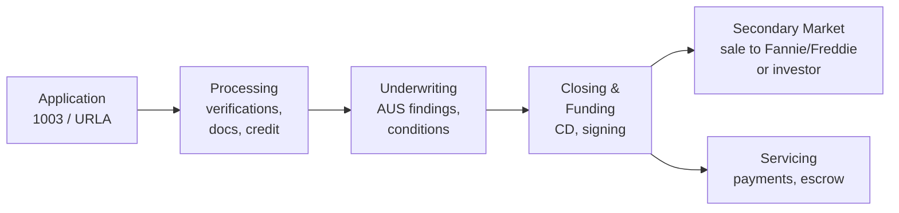

# Chapter 0 — Orientation: The Mortgage Industry & Why You're Here

**Branch:** `chapter/00-orientation` | **Time:** ~30 min | **Demo:** environment check script

---

## 0.1 What ICE Mortgage Technology does

ICE (Intercontinental Exchange) Mortgage Technology is the largest mortgage-technology vendor in the US.
The product you care about for this interview is **Encompass** — a **Loan Origination System (LOS)**.

A LOS is the system of record for the **origination** side of the mortgage lifecycle: from the moment a borrower applies until the loan is funded and sold.

ICE's broader ecosystem (good vocabulary for the interview):

| Product | What it does |
|---|---|
| **Encompass (LOS)** | Origination: application intake, processing, underwriting workflow, closing |
| **MSP** | Loan **servicing**: payments, escrow, defaults — the life of the loan *after* closing |
| **Simplifile** | eRecording of documents with county recorders |
| **Encompass Partner Connect / APIs** | Integrations with credit bureaus, AUS, pricing engines, doc vendors, title, flood, fraud |

**Interview tip:** Saying "Encompass is the LOS; MSP is the servicer; the two sides are origination and servicing" immediately signals domain awareness.

---

## 0.2 The mortgage lifecycle (learn this cold)



1. **Application** — borrower fills out the **1003** (Uniform Residential Loan Application, aka **URLA**). In Encompass this is the loan file.
2. **Processing** — processor collects verifications: income (VOE), assets (VOA), employment, credit report, appraisal, title, flood cert.
3. **Underwriting** — underwriter evaluates risk, often guided by an **AUS** (Automated Underwriting System): Fannie's **DU** or Freddie's **LPA**. Issues conditions.
4. **Closing & Funding** — Closing Disclosure (CD) signed, loan funds, docs recorded.
5. **Secondary market** — loan is typically sold to **Fannie Mae / Freddie Mac (GSEs)** or an investor; delivery files use **MISMO** XML standards.
6. **Servicing** — collecting payments, managing escrow, handling delinquency (MSP's world).

---

## 0.3 Terms you'll hear in the interview

| Term | Meaning |
|---|---|
| **1003 / URLA** | The standard loan application form |
| **AUS (DU / LPA)** | Automated underwriting engines (Fannie / Freddie) |
| **MISMO** | XML data-exchange standard for the mortgage industry |
| **LTV** | Loan-to-Value = loan amount ÷ property value |
| **DTI** | Debt-to-Income = monthly debt ÷ monthly income |
| **TRID** | "Know Before You Owe" — LE/CD disclosure timing rules (TILA-RESPA) |
| **HMDA** | Reporting of loan application data for fair-lending monitoring |
| **ECOA / Reg B** | Prohibits discrimination; drives **adverse action** notice rules |
| **RESPA / TILA** | Core consumer-protection regulations |
| **Encompass SDK / APIs** | How external systems read/write loan data in Encompass |

**Why QE matters here:** data flows through dozens of integrations. A mapping bug (e.g., wrong occupancy code sent to an AUS) is a *compliance* incident, not just a defect. That's why your lab emphasizes **data contracts, validation, traceability, and evidence**.

---

## 0.4 Where your lab fits

Encompass-sized systems can't be demoed in an interview. So your lab models **one honest slice**:

> A synthetic loan-application intake record — the same *shape* of data a POS sends to a LOS — and you show how you'd engineer quality around it: contracts, validation, API tests, CI gates, AI-assisted test design with guardrails, and traceability.

You are explicitly **not** making lending decisions. LTV/DTI in the lab are *data-calculation integrity checks*, never eligibility logic. Say this out loud in the interview — it shows you understand the compliance boundary.

---

## 0.5 Demo: environment check

Chapter 0's demo is small by design: prove your toolchain is ready before we write real code in Chapter 1.

Run from the repo root:

```bash
node scripts/env-check.mjs
```

Expected output: green checks for Node ≥ 20 and Git. If anything is red, fix it now before moving on.
