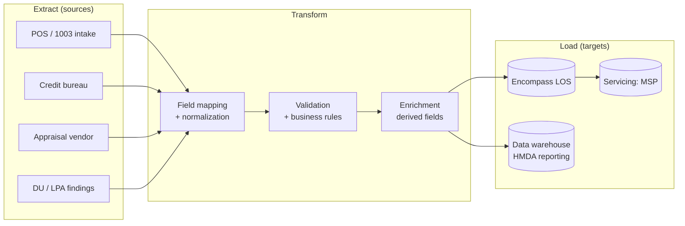

# Chapter 2 — Data Quality & ETL Concepts

**Branch:** `chapter/02-data-quality-etl` | **Time:** ~60 min | **Demo:** schema validator that passes the good CSV and **fails the bad CSV with evidence**

---

## 2.1 ETL: the plumbing of the mortgage industry

**ETL = Extract → Transform → Load.** Every mortgage platform is, at its core, a web of ETL jobs:



Key ETL vocabulary for the interview:

| Term | Meaning | Mortgage example |
|---|---|---|
| **Data contract** | Agreed schema between producer and consumer | POS promises `loanAmount` is a positive number |
| **Idempotency** | Re-running a job produces the same result, no duplicates | Re-sent application doesn't create a second loan file |
| **Reconciliation** | Proving source and target match after a load | Count + checksum of applications sent vs received |
| **Dead-letter / quarantine** | Bad records go aside, not silently dropped | Malformed application routed to a review queue |
| **Schema-on-read vs write** | Validate at ingest (write) vs at query (read) | LOS validates at ingest — bad data must never enter |

---

## 2.2 Why data quality *is* quality engineering in mortgage

Remember Chapter 1's demo: the ratio script caught 1 of 4 planted defects. The other three computed happily:

- **Negative loan amount** → math works, business nonsense
- **Malformed application ID** → reconciliation breaks downstream
- **Consent false + status submitted** → TRID/E-SIGN compliance violation

In production, these defects don't stay local. A bad `propertyValue` flows into LTV, into AUS findings, into HMDA reporting, into investor delivery files (**MISMO** XML). One field, four regulatory surfaces. That's why the industry validates **at the gate** — schema-on-write.

### The fix: a data contract

[schemas/mortgage-application.schema.json](../../schemas/mortgage-application.schema.json) is a **JSON Schema** (draft 2020-12) that encodes the contract:

- `applicationId` must match `^APP-[0-9]{8}$` (pattern)
- Enums for `loanPurpose`, `occupancy`, `propertyType`, `creditScoreBand`, `status`
- `minimum: 0` on all money/income fields
- Required fields must all be present

The [validator script](../../scripts/validate-data.mjs) adds the **business rules a schema can't express**:

- `submitted`/`in_review` status **requires** both consents = true (the TRID/E-SIGN rule)
- `loanAmount` must not exceed `propertyValue` (LTV ≤ 100% sanity rule)
- Duplicate `applicationId` detection (reconciliation/idempotency check)

This layered design — *schema for structure, code for semantics* — is how real validation pipelines are built.

---

## 2.3 Evidence, not just pass/fail

The validator writes `artifacts/data-validation-report.json`:

```json
{
  "file": "data/synthetic-loans-invalid.csv",
  "totalRows": 4,
  "validRows": 0,
  "errorCount": 6,
  "errors": [ { "row": 1, "field": "loanAmount", "message": "..." } ]
}
```

This is the difference between *"tests failed"* and *audit-ready evidence*. In a regulated shop, the artifact is the deliverable — it's what you show Compliance and what CI archives (Chapter 4).

**Interview line:** *"A quality gate without evidence is just an opinion. My validators emit structured reports so every failure is traceable to a row, a field, and a rule."*

---

## 2.4 Demo: the quality gate

Run both gates from the repo root:

```bash
# Gate 1 — the good portfolio must PASS (exit 0)
node scripts/validate-data.mjs data/synthetic-loans.csv

# Gate 2 — the bad portfolio must FAIL (exit 1) with evidence
node scripts/validate-data.mjs data/synthetic-loans-invalid.csv
```

**Expected: good file**

```
✅ data/synthetic-loans.csv — 4/4 rows valid
📄 Report written to artifacts/data-validation-report.json
```

**Expected: bad file**

```
❌ data/synthetic-loans-invalid.csv — 0/4 rows valid, 6 errors

  Row 1 (APP-00000001): loanAmount must be >= 0
  Row 2 (APP-ABC): applicationId must match pattern ^APP-[0-9]{8}$
  Row 3 (APP-00000003): loanPurpose must be one of purchase, refinance
  Row 3 (APP-00000003): propertyValue must be > 0
  Row 4 (APP-00000004): submitted status requires privacyConsent = true
  Row 4 (APP-00000004): submitted status requires electronicConsent = true

📄 Report written to artifacts/data-validation-report.json
```

Exit code is 1 on failure — which is exactly what makes it a **gate** in CI next chapter.

**Try it yourself:** edit the valid CSV (change a `status` to `submitted` on row 4 without fixing consents) and watch the gate catch it. Then revert. This is the feedback loop a mortgage QE lives in.
