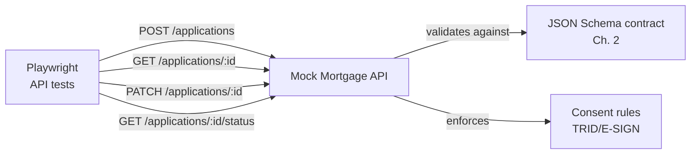

# Chapter 3 — API Testing with Playwright

**Branch:** `chapter/03-api-testing-playwright` | **Time:** ~60 min | **Demo:** Playwright API suite against a local mock mortgage API

---

## 3.1 Why API testing is the center of mortgage QE

A LOS like Encompass is really a hub of API integrations. At intake alone, one application triggers calls to: credit bureaus, AUS (DU/LPA), pricing engines, fraud checks, flood certs, title, doc vendors. UI tests can't cover that web — **API tests are where mortgage quality lives or dies.**



Our mock API ([mock/server.mjs](../../mock/server.mjs)) isn't a dumb stub — it **reuses the Chapter 2 contract** to validate incoming payloads, and returns realistic HTTP semantics: `201` on create, `400` on contract violation, `404`/`409` where appropriate. That makes it a real test target, not a formality.

## 3.2 The test design vocabulary

| Category | What it proves | Lab example |
|---|---|---|
| **Positive** | Happy path honors the contract | POST valid application → 201, `applicationId` echoed |
| **Negative** | Bad input is *rejected*, loudly | POST without consent → 400 with error detail |
| **Boundary** | Edges behave | LTV exactly 100% vs 100.01%; loanAmount = 0 |
| **Authorization** | Roles are enforced | Missing/invalid token → 401; borrower can't PATCH status |
| **Data integrity** | Round-trips are lossless | GET after POST returns identical field values |
| **Idempotency** | Retries don't duplicate | Same payload POSTed twice → same `applicationId`, one record |

That last row is pure mortgage: POS systems retry submissions on flaky networks. If your LOS creates two loan files for one retry, processors work the same loan twice and reconciliation explodes. Idempotency tests are not exotic — they're table stakes.

## 3.3 Why Playwright for API tests (not Postman)?

Postman is great for exploration. But Playwright gives you:

1. **Code, not collections** — tests are versioned, reviewed, and diffed like software.
2. **Same runner as UI tests** — one CI gate runs both (Chapter 4), one report format.
3. **Programmable assertions** — contract validation with Ajv inside the test, dynamic data, loops over the CSV.
4. **Traces as evidence** — request/response captured on failure, archived as CI artifacts.

**Interview line:** *"I use Postman to explore, but I keep authoritative tests in code next to the repo — Playwright gives me API and UI coverage in one pipeline with one evidence format."*

## 3.4 The demo

Terminal 1 — start the mock API:

```bash
npm run mock:api     # listens on http://localhost:4010
```

Terminal 2 — run the suite:

```bash
npm test             # 8 API tests
npm run test:report  # open the HTML report
```

**What's covered** ([tests/api/mortgage-api.spec.js](../../tests/api/mortgage-api.spec.js)):

| Test | Type | Maps to |
|---|---|---|
| POST creates a valid synthetic application (201) | positive | RQ-001/002 |
| POST echoes data back losslessly on GET | data integrity | RQ-004 |
| POST missing consent → 400 with rule reference | negative/compliance | RQ-005 |
| POST negative loanAmount → 400 (schema) | negative | RQ-004 |
| POST malformed applicationId → 400 | negative | RQ-001 |
| Boundary: loanAmount == propertyValue (LTV=100%) allowed | boundary | RQ-004 |
| POST without auth token → 401 | authorization | RQ-006 |
| Same payload twice → same id, still one record | idempotency | RQ-007 |

**Expected:** `8 passed`. Then open the report — every request/response is inspectable evidence.

**Try breaking it:** in [mock/server.mjs](../../mock/server.mjs), comment out the consent check, re-run, and watch the negative test fail. That's the regression-safety loop: *the test notices when the rule disappears.*
