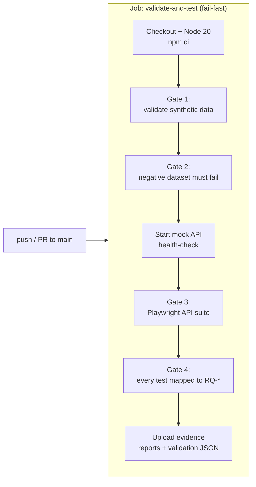

# Chapter 4 — CI/CD Quality Gates with GitHub Actions

**Branch:** `chapter/04-cicd-quality-gates` | **Time:** ~45 min | **Demo:** a real pipeline runs on GitHub when you push this branch

---

## 4.1 What CI/CD means in a regulated shop

| Term | Plain meaning | Mortgage analog |
|---|---|---|
| **CI (Continuous Integration)** | Every push/PR is built and verified automatically | Every mapping change re-validated before merge |
| **CD (Continuous Delivery/Deployment)** | Verified builds can be released repeatably | Release trains into Encompass-adjacent services with evidence |
| **Quality gate** | An automated pass/fail decision that blocks progression | "0 critical data-validation errors or the build stops" |
| **Pipeline as code** | The pipeline is versioned YAML in the repo | Reviewed and audited like application code |
| **Evidence artifact** | Files a run preserves (reports, logs) | What you hand Compliance during an audit |

The mental model: **local tests are intentions; CI gates are enforcement.** Chapters 1–3 ran on *your* machine. This chapter moves the gates to GitHub, where they run identically for every contributor and every pull request.

## 4.2 The pipeline anatomy

[.github/workflows/quality-gates.yml](../../.github/workflows/quality-gates.yml):



Gate design decisions worth narrating in an interview:

1. **Fail-fast ordering** — cheapest, most foundational gate (data validation, seconds) runs before the slowest (API tests). You get the signal at minute 1, not minute 10.
2. **Negative gate** (`validate:data:negative`) — CI asserts the bad file *fails* (`if: continue-on-error` trick inverted: the step runs the validator and expects exit 1; we verify with `&& exit 1 || true` logic inverted — see the YAML). This proves the gate itself still works. A gate that can't fail is not a gate.
3. **Service boot in CI** — the mock API starts as a background step with a health-check loop, exactly how you'd boot a dependency in a real pipeline.
4. **Traceability gate** — a script greps the spec file and fails the build if any test title lacks an `RQ-` mapping. Traceability is *enforced*, not aspirational.
5. **Artifacts on failure AND success** (`if: always()`) — evidence exists regardless of outcome. Auditors ask for the failures too.

## 4.3 Demo: watch the gate run on GitHub

```bash
git push -u origin chapter/04-cicd-quality-gates   # already done for you
```

Then open: https://github.com/rayme11/mortgage-ai-quality-lab-with/actions

Click the latest **Quality Gates** run. You should see:

- ✅ Gate 1: valid dataset passes
- ✅ Gate 2: invalid dataset is rejected (and CI verifies the rejection)
- ✅ Gate 3: 8/8 Playwright API tests
- ✅ Gate 4: traceability check
- 📦 **Artifacts**: `quality-evidence` containing the Playwright HTML report + validation JSON

**Break it on purpose (the best exercise in this chapter):**
1. Edit `data/synthetic-loans.csv` — set `loanAmount` on row 1 to `-320000`.
2. Commit, push, open the Actions tab.
3. Watch Gate 1 turn red and the job stop — the Playwright suite never runs (fail-fast).
4. Download the `quality-evidence` artifact from the *failed* run — the report is still there.
5. Revert and push green again.

You've just demonstrated the entire value proposition: **a defect became a blocked merge with attached evidence, with zero human involvement.**

**Interview line:** *"My gates fail fast, preserve evidence on every outcome, and treat traceability as a blocking check — because in a regulated domain, an unmapped test is indistinguishable from an untested requirement."*
