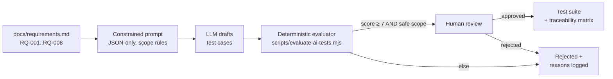

# Chapter 5 — AI-Assisted Test Generation (With Guardrails)

**Branch:** `chapter/05-ai-test-generation` | **Time:** ~60 min | **Demo:** deterministic evaluator scores AI-drafted test cases — good batch accepted, bad batch rejected

---

## 5.1 The core principle: AI drafts, determinism decides

LLMs are excellent at *ideation* — enumerating edge cases a tired engineer forgets (duplicate submissions, consent edge cases, auth roles). They're terrible at *authority* — they'll confidently invent requirements, hallucinate rules, or drift into lending-decision territory.

So the lab's rule is:

> **AI output is a draft, never an artifact.** It must pass the same kind of deterministic gates as any other code, plus human review, before it becomes a test.



Three control layers, each catching different failure modes:
1. **Prompt constraints** — cheap, preventive. Catches scope drift before it happens.
2. **Deterministic evaluation** — free, repeatable, auditable. Catches hallucinated requirement IDs, missing fields, forbidden terms.
3. **Human review** — expensive, judgment-based. Catches nuance: is this test *worth* automating?

## 5.2 The prompt matters more than the model

[docs/ai-prompts.md](../../docs/ai-prompts.md) contains the two prompt versions:

- **Prompt A** (naive): *"Generate test cases for a mortgage application API."* — produces plausible but untraceable cases; no requirement IDs, sometimes strays into eligibility logic.
- **Prompt B** (constrained): JSON-only output, fixed schema per test case, only RQ-001..RQ-008 allowed, explicit list of forbidden topics (approval, denial, pricing, real PII), required risk statement.

You'll compare both in Chapter 6 (Azure AI Foundry). Today, we evaluate **sample outputs** of each prompt offline.

## 5.3 The evaluator

[scripts/evaluate-ai-tests.mjs](../../scripts/evaluate-ai-tests.mjs) scores each generated case on 7 deterministic checks:

| Check | Why it exists |
|---|---|
| Valid requirement ID (RQ-001..008) | Hallucinated requirements are the #1 LLM failure mode |
| Has risk statement | No risk = no prioritization basis |
| Has precondition | Otherwise the test isn't reproducible |
| Has expected result | Otherwise it's a demo, not a test |
| Has test type | Feeds the traceability matrix |
| Safe scope (no forbidden terms) | `approve`, `deny`, `underwrite`, `rate lock`, `APR`, `adverse action`, `real SSN`… |
| Has test ID | Traceability anchor |

**Verdict: `acceptedForReview` only if score ≥ 7/7 AND scope-safe.** Even then it's "accepted *for review*" — the human still decides. Written evidence goes to `artifacts/ai-test-evaluation.json`.

This mirrors your evaluator-agent story directly: *"I do not treat AI output as an authoritative test artifact. I use it to accelerate drafting, then apply deterministic checks, requirement traceability, rubric scoring, guardrails, and human review."*

## 5.4 Demo: two batches, two outcomes

[artifacts/samples/ai-tests-good.json](../../artifacts/samples/ai-tests-good.json) — what constrained Prompt B produces (4 well-formed cases).
[artifacts/samples/ai-tests-bad.json](../../artifacts/samples/ai-tests-bad.json) — what naive Prompt A produces (hallucinated IDs, forbidden scope, missing fields).

```bash
npm run evaluate:ai:good     # expect: 4/4 accepted for review, exit 0
npm run evaluate:ai:bad      # expect: rejections with reasons, exit 1
```

Expected for the bad batch:

```
❌ AI-TC-101 (score 5/7) — unknown requirementId: RQ-042
❌ AI-TC-102 (score 6/7) — forbidden scope term: "approve"
❌ AI-TC-103 (score 4/7) — missing: expectedResult, risk, testType
✅ AI-TC-104 (score 7/7) — accepted for human review

1/4 cases accepted for review. Evidence → artifacts/ai-test-evaluation.json
```

**Try it:** add a case to the good file with `"requirementId": "RQ-009"` and watch it get rejected — that's the hallucination guard working.
