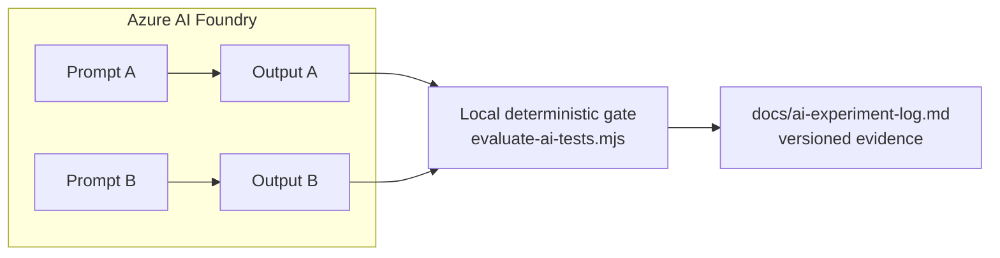

# Chapter 6 — Azure AI Foundry: Prompt Experiments

**Branch:** `chapter/06-azure-ai-foundry` | **Time:** ~45 min | **Demo:** run Prompt A vs Prompt B in the Chat Playground, evaluate both outputs with the Chapter 5 gate, log the experiment

---

## 6.1 What Azure AI Foundry is (interview framing)

**Azure AI Foundry** is Microsoft's platform for building with LLMs: model catalog (OpenAI, Llama, Phi…), playgrounds, prompt management, evaluations, tracing, and deployment. Key concepts:

| Concept | Meaning | Lab usage |
|---|---|---|
| **Hub / Project** | Workspace boundary (RBAC, cost, data isolation) | One sandbox project for the lab |
| **Model deployment** | A specific model version you call (e.g., `gpt-4o`) | Your experiment subject |
| **Chat Playground** | Interactive prompt testing UI | Where Prompt A/B run |
| **Evaluation** | Scoring outputs — built-in metrics or your own | Our deterministic evaluator is "your own" |
| **Prompt flow / traces** | Versioned, replayable prompt pipelines | Overkill today; name-drop for interviews |

> ⚠️ **Scope note for the interview:** in the lab you *manually* paste playground output into a file and run the local evaluator. In production you'd wire the Foundry Evaluation SDK or a batch pipeline — same rubric, automated. Saying that transition out loud shows architectural maturity.

## 6.2 Setup (portal, ~10 min)

1. Go to https://ai.azure.com and sign in.
2. Create a **project** (or reuse an existing sandbox). Name suggestion: `mortgage-ai-quality-lab`.
3. In the project, open **Deployments** → deploy a chat model (e.g., **gpt-4o** or **gpt-4o-mini**) if none exists. Use the cheapest available tier — this is a demo.
4. Open **Chat Playground**, select your deployment.

**Rules while you're in there:** synthetic data only; paste nothing real; record model name + version + date (reproducibility).

## 6.3 The experiment: Prompt A vs Prompt B

Both prompts are in [docs/ai-prompts.md](../../docs/ai-prompts.md). Protocol:

**Run 1 — Prompt A (naive):**
1. Paste Prompt A into the playground, submit.
2. Copy the raw output into a new file: `artifacts/foundry/prompt-a-output.json` (if the model returns prose around JSON, paste as-is — the messiness is data).
3. Run the gate: `node scripts/evaluate-ai-tests.mjs artifacts/foundry/prompt-a-output.json`

**Run 2 — Prompt B (constrained):**
1. Start a *new* chat (no context bleed), paste Prompt B, submit.
2. Save output to `artifacts/foundry/prompt-b-output.json`.
3. Run the gate on it.

**Fill in the log** — [docs/ai-experiment-log.md](../../docs/ai-experiment-log.md):

| Prompt | Cases | Passed gate | Notes |
|---|---|---|---|
| A | ? | ? | e.g., "prose wrapper, 2 cases invented RQ-011" |
| B | ? | ? | e.g., "clean JSON, all RQ-mapped" |

## 6.4 What you're demonstrating

The claim this proves: **prompt engineering is measurable.** You're not saying "Prompt B feels better" — you have acceptance rates from an identical deterministic rubric, recorded in version control, tied to model/version/date. That's an *experiment*, and experiments are what separate "uses AI" from "engineers with AI."

**Interview line:** *"I compared prompt versions with a fixed deterministic rubric — acceptance rate, not vibes. The constrained prompt scored X/Y vs the naive one at X/Y. And every run recorded model, version, and date so the comparison is reproducible."*

## 6.5 Optional stretch (if time allows)

- **Evaluation SDK:** Foundry's built-in evaluators (coherence, groundedness) complement — never replace — your domain rubric.
- **CI integration:** the evaluator already exits non-zero on rejection, so it could run in the Chapter 4 pipeline against any checked-in AI output. (We wire this in Chapter 7's gate table.)
- **Do NOT fine-tune** for this project — no reviewed, representative training set exists, and saying so demonstrates judgment.

## 6.6 If you can't access Foundry today

No problem — the chapter still works. Use any approved LLM (Copilot chat, ChatGPT, Claude), follow the same A/B protocol, and note the tool in the log's "Model" column. The learning objective is the *experiment discipline*, not the specific portal.
